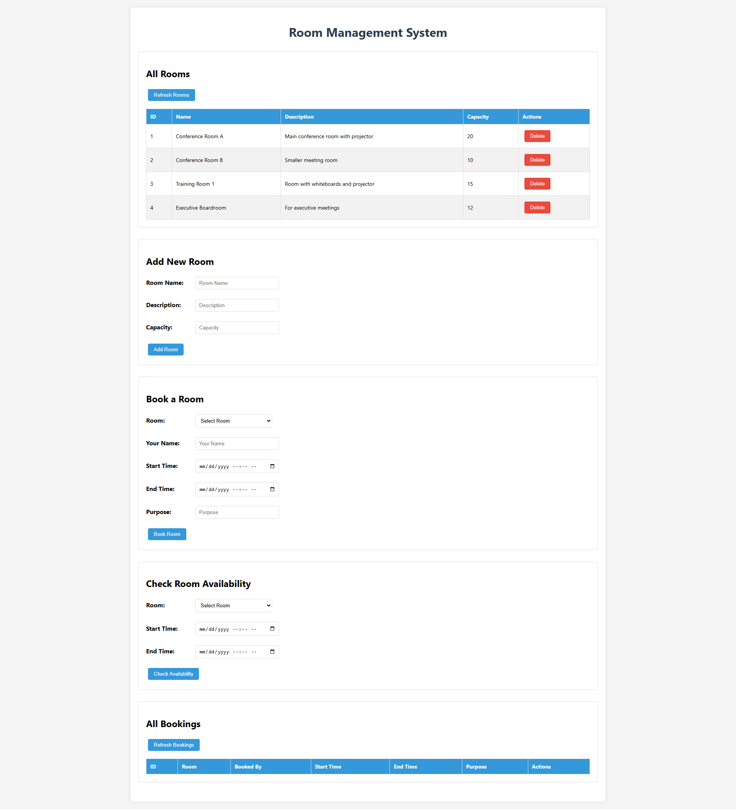
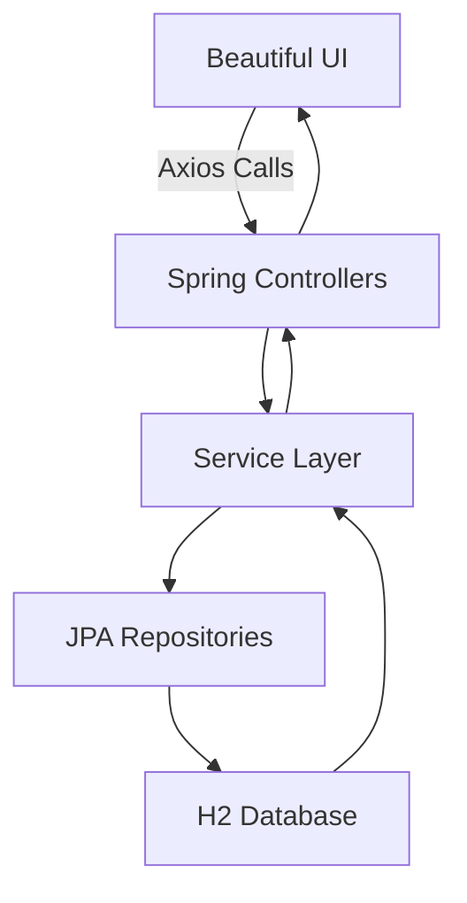

# 🏨✨ **RoomEase** - Smart Room Management System ✨🏨  

  
*"Effortless room bookings at your fingertips!"*  

---

## 🌟 **Why RoomEase?**  
Tired of messy spreadsheets and double-booked conference rooms? **RoomEase** is your all-in-one solution for:  
- ✅ **Instant** room availability checks  
- 📅 **Seamless** booking management  
- 📊 **Real-time** updates  
- 🚀 **10x faster** than traditional systems  

Built with ❤️ using modern tech stack for reliability and performance.  

---

## 🎨 **Features That Spark Joy**  

### 🏢 **Room Management**  
| Icon | Feature          | Description                          |
|------|------------------|--------------------------------------|
| 🆕   | Add Rooms        | Create rooms with details & capacity |
| 👀   | View All         | Beautiful table display              |
| 🗑️   | Delete Rooms     | One-click removal                    |

### 📅 **Booking Magic**  
| Icon | Feature          | Description                          |
|------|------------------|--------------------------------------|
| ⏱️   | Smart Scheduling | Conflict-free time slot selection    |
| 🔍   | Availability     | Real-time availability checker       |
| ✏️   | Easy Booking     | 3-step booking process               |
| ❌   | Cancel Anytime   | Flexible cancellations               |

### 🌈 **User Experience**  
| Icon | Feature          | Description                          |
|------|------------------|--------------------------------------|
| 📱   | Responsive       | Works on all devices                 |
| 🎨   | Beautiful UI     | Clean, modern interface              |
| ⚡   | Fast Loading     | Optimized performance                |

---

## 🛠️ **Tech Stack**  

**Frontend**  


**Backend**  


**Tools**  


---

## 🚀 **Getting Started in 3...2...1...**  

### Prerequisites  
- ☕ Java 17+  
- 🍃 Maven 3.8+  
- 🐙 Git  

### Installation  
```bash
# Clone with excitement!
git clone https://github.com/yourusername/roomease.git
cd roomease

# Install with love
mvn clean install

# Launch the magic
mvn spring-boot:run
```

Visit **[http://localhost:8080](http://localhost:8080)** and let the booking begin! 🎉

---

## 📚 **API Playground**  

```javascript
// Get all available rooms
fetch('/api/rooms')
  .then(response => response.json())
  .then(data => console.log('Rooms:', data));

// Book your dream room
fetch('/api/bookings', {
  method: 'POST',
  body: JSON.stringify({
    roomId: 1,
    bookedBy: "Your Name",
    startTime: "2025-05-20T09:00:00",
    endTime: "2025-05-20T11:00:00",
    purpose: "Team Innovation Session"
  })
});
```

---

## 🧩 **System Architecture**  



---

## 🌱 **Contributing**  

We welcome all contributions! Here's how:  

1. 🍴 Fork the repository  
2. 🌱 Create your feature branch (`git checkout -b feature/amazing-feature`)  
3. 💾 Commit your changes (`git commit -m 'Add some amazing feature'`)  
4. 🚀 Push to the branch (`git push origin feature/amazing-feature`)  
5. 🔄 Create a new Pull Request  

---

## 📜 **License**  

MIT Licensed. Code with care, share with love.  

---

## ✨ **Special Thanks**  

*To all the coffee beans ☕ that made this project possible!*  

---

**Ready to revolutionize your room management?**  
Give ⭐ to show your love! 🚀  

[](https://github.com/yourusername/roomease)  

*Built with ❤️ by [Your Name]*
